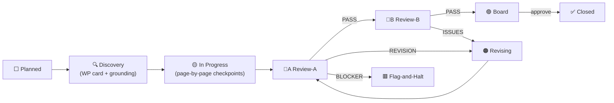

# FE Program Management Office — `project-management/`

**Frontend Program Management · v1.0 · Status: FROZEN at cutover (Board-ratified, plan v6,
2026-07-02)** · **Role:** execution layer over the frozen page plan.
**Non-authoritative companion.** Conforms upward; coins nothing. On any conflict the frozen corpus
wins (CLAUDE.md §7, §11) and this folder is patched to match.

This folder is the **program-management office** for the presentation-only frontend program:
milestone-driven, pull-based, twice-reviewed, Board-approved. It replaced the page-by-page loop at
the 2026-07-02 cutover (terminus: RV-0100 / commit `9161143`; decision trail in the plan's
disposition logs and `changelog.md`).

**Wave-gate binding:** this FE program is the owner-authorized **presentation-only parallel
stream** ("parallelization, not reorder"). It does NOT reorder or supersede the frozen
`generatedDocs/Build_Roadmap_v1.0.md` wave gates; backend wiring stays wave-gated per §7. This
program can never be read as superseding the roadmap.

## Precedence & pointers (reference-never-restate)

```
Master → ADR → Doc-2/3 → Doc-4A…4M → Doc-5A…5K → Doc-7A → {7B,7C,7D…7H} → Code
                                                              ▲ this folder tracks, never overrides
```

- **Page IDs + per-page metadata:** [`page_inventory.md`](../page_inventory.md) — the frozen
  144-page record. Milestones **reference** `P-*` IDs; they never re-list or re-coin pages.
- **Gap handles:** [`esc_registry.md`](../esc_registry.md) — every gate cites a handle; never
  invent a contract.
- **Page standards / vocab:** [`shared_conventions.md`](../shared_conventions.md) +
  [`page-standards.md`](page-standards.md) (per-page Definition of Done — unchanged).
- **Process:** [`review-process.md`](review-process.md) — states, lanes, verdicts, milestone DoD,
  WP-card template, derivation chain, glossary.
- **Charters:** `../governanceReviews/REVIEW-TEAM-A-CHARTER_v1.0.md` ·
  `../governanceReviews/TEAM-4-QCT-CHARTER_v1.0.md` + `TEAM-4-QCT-CHARTER_AMENDMENT_v1.1.md` ·
  commit policy `../governanceReviews/BOARD-DECISION-FE-COMMIT-POLICY_v1.0.md`.

## Organization

```
Architecture Board (owner + Claude — the OWNER holds every approval pen)
        │
        ▼
FE Program Manager (this tracker — maintenance role, no approval power)
        │
        ├──────────────┬──────────────┐
        ▼              ▼              ▼
   Team-1          Team-2         Team-3
   Public/PF       Buyer          Vendor
        │
        └────── submit milestone at a stable SHA ──────┐
                                                       ▼
                            Review Team 4 (Architecture & Governance) — fresh context
                                                       ▼
                            Review Team 5 (Quality & Adversarial) — fresh context
                                                       ▼
                                        Board approval (human owner)
                                                       ▼
                                        ✅ Close → next milestone from queue
```

| Role | Owns |
|---|---|
| **Team-1** | Builder/Maintainer: FE-PUB track · FE-PF-06 · FE-ACC record track |
| **Team-2** | Builder/Maintainer: FE-BUY track · FE-CLN-01 |
| **Team-3** | Builder/Maintainer: FE-VEN track · FE-ADM record track |
| **Kit owner (Board-assigned)** | FE-PF-01..05 · FE-DS track (full design system) · Maintainer of FE-SH extractions |
| **Review Team 4 (A lane) / Review Team 5 (B lane)** | Review only — raise, never rule (fresh context each, never the builder's). Team 4 = Architecture & Governance (ex-QCT, `REVIEW-TEAM-A-CHARTER` + amendment v1.2) · Team 5 = Quality & Adversarial (`REVIEW-TEAM-5-CHARTER`) |
| **Architecture Board** | Approval · WP cards at kickoff · scope/status changes · FE-SH/FE-DS gates · decision records · **FE-* ID minting (Board-only)** |

**Binding rules (carried forward from the loop, unchanged):**

1. Each milestone has exactly one Builder team; **only the Builder** may set it 🟡.
2. **At most ONE milestone 🔍/🟡 per team** at a time.
3. Reviewers never modify implementation (**Raise ≠ Accept**, CLAUDE.md §13; Validate-Findings
   gate on every finding).
4. Severity ladder + gate **BLOCKER 0 · MAJOR 0 · MINOR 0** (§13).
5. **Stable-target rule** — milestone reviews only at a named SHA.
6. **ESC discipline** — a gap cites its `esc_registry.md` handle and ships the interim; never
   invent a contract.
7. Presentation-only authorization — no backend/wiring; wiring stays wave-gated.
8. `changelog.md` is append-only; nothing is ever edited or deleted.

## The loop



Failure edges, lane rules (G/L), re-entry rules, and terminal states (❌/♻):
[`review-process.md`](review-process.md).

### Prompt A′ — Pull & Build (Builder team)

```
Read project-management/current-focus.md FIRST.
Pull your team's Current Milestone from execution-board.md — never take work from chat.
Read its WORK-PACKAGE.md (governanceReviews/milestones/<fe-id-slug>/): scope, OUT-OF-SCOPE,
dependencies, lane. Skip any milestone whose H: dependency or ⛔ gate is open — record the handle.
READY(enh) = enhance IN PLACE (BX-01/BX-02 model) — never rebuild; already-✅ pages keep their RV.
Build ONE page at a time:
  - reuse kit/shared components (src/frontend/, surface _components/); never duplicate primitives
  - honor page-standards.md (presentation-only, wired-contracts-only, byte-equivalence,
    trust band-only, no invented perf budgets, neutral routing)
  - realistic industrial-procurement mock data; mobile-responsive; WCAG-AA
Per page: DoD self-check → changelog line → checkpoint commit feat(FE-XXX-NN): P-YYYY … [checkpoint].
When the WP scope is complete: set 🔵A at the checkpoint SHA in execution-board.md + changelog.
STOP. Never pull the next milestone before Board close.
```

### Prompt B1 — Review Team 4, A lane (fresh context)

```
You are Review Team 4 — Architecture & Governance (governanceReviews/REVIEW-TEAM-A-CHARTER_v1.0.md
+ TEAM-4-QCT-CHARTER_AMENDMENT_v1.2.md). Fresh context — do not
reuse the builder's session. Review milestone FE-XXX-NN at its recorded SHA (stable-target)
against: frozen corpus/Doc-7 · no-invention · boundaries · scope-vs-WP-card (enforce Out-of-scope)
· reuse · governance (Inv#, firewall, byte-equivalence, R5/R6/R7, DF-6) · a11y patterns ·
dependency analysis · promotion candidates.
Carry-forward rule: enhancement milestones — review the DELTA only; cite existing RVs.
Return PASS | REVISION | BLOCKER + numbered findings (BLOCKER/MAJOR/MINOR/NIT/OBS).
Log under a new RV-#### (milestone template v2, review-process.md §8). Never edit implementation.
```

### Prompt B2 — Review Team 5, B lane (fresh context, only after A pass-class)

```
You are Review Team 5 — Quality & Adversarial (governanceReviews/REVIEW-TEAM-5-CHARTER_v1.0.md).
Fresh context. Review
milestone FE-XXX-NN at the SAME SHA: UI consistency · responsive D/T/M · duplication (quality
lens) · dead code · imports · type safety · lint · prettier · render verification · screenshots
into governanceReviews/milestones/<fe-id-slug>/ · visual regression vs the folder baseline ·
cross-team regression. Governance defect spotted? Raise it routed-to-A — never drop it.
Return PASS | ISSUES | REGRESSION + numbered findings. Append the B-verdict to the same RV-####.
```

### Prompt C′ — Board close (owner approval required)

```
Gate: A:PASS ∧ B: BLOCKER=MAJOR=MINOR=0. Rule every finding via the Validate-Findings gate (§13).
Confirm the uniform milestone DoD on the WP card (review-process.md §6). OWNER approves.
Milestone-close commit: milestone(FE-XXX-NN): close — RV-00NN A:PASS B:PASS board-approved.
Update fe-program-wbs.md status, execution-board.md queue, promotion-watchlist.md, changelog.md.
Close the WP card (immutable from now on). Author the next milestone's WP card and assign it.
```

## Files in this folder

[`fe-program-wbs.md`](fe-program-wbs.md) (roadmap — milestones only) ·
[`execution-board.md`](execution-board.md) (queues · gated/parked registers · Board agenda) ·
[`review-process.md`](review-process.md) (process) ·
[`promotion-watchlist.md`](promotion-watchlist.md) (promotions) ·
[`current-focus.md`](current-focus.md) (pointer — read first) ·
[`team-1.md`](team-1.md) / [`team-2.md`](team-2.md) / [`team-3.md`](team-3.md) (page-level source
records) · [`review-log.md`](review-log.md) (RV-####) · [`changelog.md`](changelog.md)
(append-only history) · [`page-standards.md`](page-standards.md) (page DoD) ·
[`product-status.md`](product-status.md) (dated snapshots) · `frontend-wbs.md` (deprecated stub).

## Governance note

`frontend_first_slice.md` records FE as "planned, not buildable until Wave 3." The owner has
authorized **presentation-only** parallel FE work ahead of that sequence. This office operates
**inside that authorization**, tracks the authorized parallel stream, and does **not** reorder the
roadmap. Backend wiring stays gated to each module's wave.
