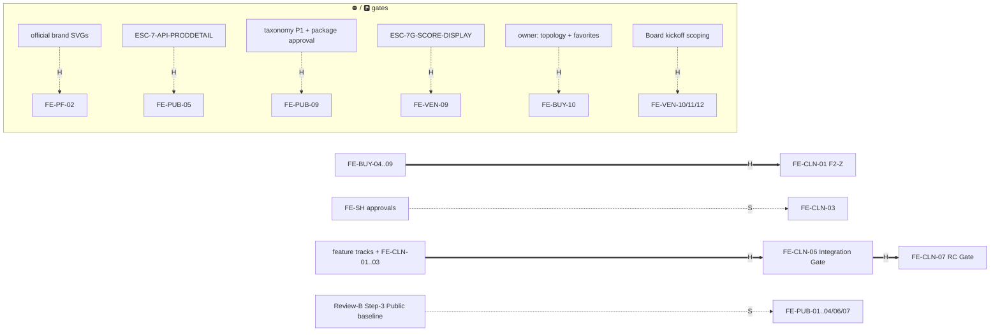

# FE Program WBS — Roadmap

**Frontend Program Management · v1.0 · Status: FROZEN at cutover (Board-ratified, plan v6,
2026-07-02).** Changes = additive amendment + version bump. Non-authoritative under the frozen
corpus (§7). **Owner (maintains): FE Program Manager** — status/derivation updates only; scope
changes and **new FE-* IDs are Board-only** (teams request, the Board mints).

**ROADMAP ONLY** — what · lifecycle owners · status · dependencies · gates. Queues and registers:
[`execution-board.md`](execution-board.md) · process: [`review-process.md`](review-process.md) ·
promotions: [`promotion-watchlist.md`](promotion-watchlist.md). `FE-*` IDs are program-management
handles, never corpus IDs; milestones **reference** frozen `P-*` pages
([`page_inventory.md`](../page_inventory.md)), never re-coin them.

**Wave-gate binding:** presentation-only parallel stream (owner-authorized, "parallelization, not
reorder") — never reorders or supersedes `generatedDocs/Build_Roadmap_v1.0.md`; wiring stays
wave-gated (§7).

## Derivation rule (binding)

Milestone status is **derived** from the owning team file's page rows (`team-1/2/3.md` = the
page-level source record) via the priority chain in `review-process.md` §9. **Owns vs touches:**
"owns" = coverage accounting (every P-* page exactly once program-wide); "touches" = may modify
without owning — only "owns" counts toward 144. **Page-gate carve-out:** an ESC-gated page inside
a milestone never blocks milestone close; it stays ⛔ tracked at page level and re-enters when its
handle resolves (the "cluster COMPLETE − P-ACC-12" convention). Statuses re-derived at cutover,
2026-07-02, post-RV-0100.

**Disambiguation:** shell *pages* (`P-SH-*`) are owned by milestone **FE-PF-06**; the **FE-SH-***
track is component *promotions* and owns no pages.

## Row schema

`ID · Title · Value (immutable: Core Marketplace | Procurement Moat | Trust | Vendor Growth |
Buyer Productivity | Platform) · Builder/Maintainer · Priority (P0–P3, SC §8) · Size (S/M/L/XL) ·
Risk (Low/Med/High) · Depends-on (H: hard / S: soft — real dependencies only, never queue order) ·
Owns (P-*) · Status · Scope`. Business Value = program label grounded in CLAUDE.md §1, not a
corpus term; set at creation, Board-only changes.

---

## Track 0 — FE-PF Platform Foundation

**Baseline (historical record — closed, never reopens):**
FE-PF-01 Design Tokens ✅ (ongoing ownership → FE-DS) · FE-PF-03 Platform Shell ✅ **frozen**
(extend, never duplicate) · FE-PF-04 Responsive Framework ✅ · FE-PF-05 Navigation Framework ✅
(simple nav; mega menu = FE-PUB-09).

**Active:**

| ID · Title | Value | Bld/Mnt | Pri | Sz | Rk | Depends-on | Owns | Status · Scope |
|---|---|---|---|---|---|---|---|---|
| FE-PF-02 Brand System | Platform | Kit owner | P1 | S | Low | H: official SVGs (Board agenda #1) | — | 🟡 95% — runtime branding complete except official, unmodified SVGs under `public/brand/` (never regenerated) |
| FE-PF-06 Shell & System Pages | Platform | T1 | P1 | M | Med | — | P-SH-01..06 | ✅ Complete — 01/02/05/06 ✅ (RV ledger), 03/04 🟩 legacy. Shell-mount ratification (search/notifications) on Board agenda #8 |

## Track 1 — FE-PUB Public (Builder/Maintainer: Team-1)

| ID · Title | Value | Pri | Sz | Rk | Depends-on | Owns | Status · Scope |
|---|---|---|---|---|---|---|---|
| FE-PUB-01 Landing | Core Marketplace | P1 | M | Low | S: Step-3 baseline | P-PUB-01 | READY(enh) — owner-named polish item on the pre-loop 🟩 landing |
| FE-PUB-02 Discovery | Core Marketplace | P1 | L | Med | S: Step-3 baseline | P-PUB-07, P-PUB-09 | ✅ Complete (RV-0107, A:PASS B:PASS, Dev-team self-close 2026-07-02 @ `5d9d94a`) — Categories index (P-PUB-07): featured categories, capability cards, search entry-point polish, featured vendors/products over the 🟩 stock, 22 OBS total, 0 B/M/M/NIT. P-PUB-09 stays ⛔ `ESC-7-API-CATNAV` (page-gate carve-out, not built). Promotion candidate raised: `FeaturedCategoryGrid` extraction |
| FE-PUB-03 Vendor Profile | Vendor Growth | P1 | M | Med | S: Step-3 baseline | P-PUB-13..17 | READY(enh) — public microsite pages (🟩) |
| FE-PUB-04 Category Page | Core Marketplace | P1 | S | Low | S: Step-3 baseline | P-PUB-08 | READY(enh) — 🟩 "partial, verify facets" |
| FE-PUB-05 Product Detail | Core Marketplace | P1 | M | Med | H: `ESC-7-API-PRODDETAIL` | P-PUB-11 | ⛔ Gated — interim: modal from `search_catalog` |
| FE-PUB-06 Vendor Directory | Vendor Growth | P1 | S | Low | S: Step-3 baseline | P-PUB-12 | READY(enh) — 🟩 |
| FE-PUB-07 Search Result | Core Marketplace | P1 | M | Low | S: Step-3 baseline | P-PUB-10, P-PUB-19, P-PUB-20 | READY(enh) — 10/19 🟩; 20 ✅ (ungoverned compare, no matching) |
| FE-PUB-08 Content, Legal & Segments | Platform | P2 | — | Low | — | P-PUB-02..06, P-PUB-18, P-PUB-21..24 | ✅ Complete — all 10 ✅ (RV-0086..0100 era) |
| FE-PUB-09 Mega Menu & Taxonomy Nav | Core Marketplace | P2 | L | Med | H: taxonomy P1 approval · H: MEGA_MENU package approval · S: `ESC-7-API-CATNAV` (live data) | — (touches nav + P-PUB-07/08/09) | ⛔ Double-gated — `MEGA_MENU_*.md` stay design-only until approved |

## Track 2 — FE-BUY Buyer (Builder/Maintainer: Team-2)

| ID · Title | Value | Pri | Sz | Rk | Depends-on | Owns | Status · Scope |
|---|---|---|---|---|---|---|---|
| FE-BUY-01 Dashboard | Buyer Productivity | — | — | — | — | P-BUY-01 | ✅ Complete (BX-01, RV-0070) |
| FE-BUY-02 RFQ Workspace | Procurement Moat | — | — | — | — | P-BUY-06/07/08, P-BUY-10..13 | ✅ Complete (BX-02, RV-0075; F1 freeze audit covers 🟩 stock) |
| FE-BUY-03 Quotations | Procurement Moat | — | — | — | — | P-BUY-09 | ✅ Complete |
| FE-BUY-04 Quotation Detail | Procurement Moat | P1 | M | Med | — | P-BUY-14, P-BUY-16 | ✅ Complete (RV-0102, board-approved 2026-07-02 @ `5a4550c`) — **the awaited BX-03**: quotation presentation + clarification thread |
| FE-BUY-05 Supplier Comparison | Procurement Moat | P1 | M | High | — | P-BUY-15 | ✅ Complete (RV-0108, A:PASS B:PASS, Dev-team self-close 2026-07-02 @ `79b738a`) — R6: read-only, System-generated, **never recommends**; 6 OBS total, 0 B/M/M |
| FE-BUY-06 Award | Procurement Moat | P1 | S | High | — | P-BUY-17, P-BUY-18 | ✅ Complete (RV-0109, A:PASS B:PASS, Dev-team self-close 2026-07-02 @ `5654956`) — R6: no default winner, unranked; 10 OBS total, 0 B/M/M |
| FE-BUY-07 Engagement | Buyer Productivity | P1 | L | Med | — | P-BUY-19..25 | READY(enh) — post-award docs; money boundary DF-6 |
| FE-BUY-08 Dashboard Widgets | Buyer Productivity | P2 | S | Low | — | — (touches P-BUY-01) | READY(enh) — counts server-provided, never client-computed (R7, RV-0070 pattern) |
| FE-BUY-09 CRM | Buyer Productivity | P2 | M | High | — | P-BUY-26, P-BUY-27 | READY(enh) — Inv#11 buyer-private; blacklist undetectable |
| FE-BUY-10 Discovery & Favorites | Buyer Productivity | P2 | M | Med | H: owner decisions (P-BUY-03/04 route topology · P-BUY-05 favorites scope/projection) | P-BUY-02..05 | 🅿 Parked — P-BUY-02 ✅; rest owner-gated (Board agenda #3) |

## Track 3 — FE-VEN Vendor (Builder/Maintainer: Team-3)

| ID · Title | Value | Pri | Sz | Rk | Depends-on | Owns | Status · Scope |
|---|---|---|---|---|---|---|---|
| FE-VEN-01 Dashboard | Vendor Growth | — | — | — | — | P-VND-01 | ✅ Complete (legacy; QCT Step-2 rollup) |
| FE-VEN-02 Company | Vendor Growth | — | — | — | — | P-VND-02..04 | ✅ Complete (legacy) |
| FE-VEN-03 Microsite | Vendor Growth | — | — | — | — | P-VND-05, P-VND-06 | ✅ Complete (legacy). M2.5 public-microsite continuation stays owner-gated (Board agenda #5) |
| FE-VEN-04 Catalog | Vendor Growth | P1 | M | Med | — | P-VND-07..11 | 🟡 Partial — 07/08/11 ✅(legacy) · **P-VND-09 🔵A Review-A** (spec library, checkpoint `a52dc1e`) · P-VND-10 ⛔ `ESC-7-API/upload` (carve-out) |
| FE-VEN-05 RFQ Workspace | Procurement Moat | P1 | M | Med | — | P-VND-15, P-VND-16 | ✅ Complete (RV-0101, A:PASS B:PASS, board-approved 2026-07-02 @ `e2f8642`) — received-only inbox needs-response-first ordering; decline = no penalty, clearer affordance |
| FE-VEN-06 Quotation Builder | Procurement Moat | P1 | L | Med | — | P-VND-17..20 | ✅ Complete (RV-0103, A:PASS B:PASS, board-approved 2026-07-02 @ `4ae0ec1`) — quotation-state visibility on the inbox, supersedes_version_no disclosure, withdraw = zero penalty; P-VND-18 wizard reviewed/untouched, S7 late-extension recorded as unbuilt gap |
| FE-VEN-07 Leads | Vendor Growth | P1 | M | Med | — | P-VND-21, P-VND-22 | ✅ Complete (RV-0104, A:PASS B:PASS, board-approved 2026-07-02 @ `b1810fe`) — next-action pill on Board cards, lead created_at provenance; client-side "due first" reorder explicitly declined (existing disabled sort control owns it) |
| FE-VEN-08 Engagements | Vendor Growth | P1 | L | Med | — | P-VND-23..26 | ✅ Complete (RV-0105, A:PASS B:PASS, board-approved 2026-07-02 @ `ec8306b`) — P-VND-24 frozen-conformant lifecycle single-next-legal-edge fix; P-VND-23 reviewed/conformant untouched; P-VND-25/26 correctly `ESC-7G-ENG-03`-gated untouched; P-VND-25 upload path still notes `ESC-7-API/upload` |
| FE-VEN-09 Trust Center | Trust | P1 | M | High | H: `ESC-7G-SCORE-DISPLAY` (+ `ESC-7B-TRUSTSCORE`) | P-VND-28 | ⛔ Gated — band-only interim; Board packet READY (agenda #2) |
| FE-VEN-10 Billing | Platform | P2 | S | Med | H: Board kickoff scoping | P-VND-27 | READY(build, kickoff-scoped) — vendor-context view **reusing P-ACC-16..21**; Builder = T3 for the adaptation, reused surfaces stay T1-maintained; **composition only — forking an account page = Flag-and-Halt** |
| FE-VEN-11 Organization | Platform | P3 | S | Med | H: Board kickoff scoping | — (reuses P-ACC-04..11) | READY(kickoff-scoped) — same rule as FE-VEN-10 |
| FE-VEN-12 Settings | Platform | P3 | S | Med | H: Board kickoff scoping | — (reuses P-ACC-02/03/13/15) | READY(kickoff-scoped) — same rule as FE-VEN-10 |
| FE-VEN-13 Ads | Vendor Growth | P2 | M | Low | — | P-VND-12..14 | ✅ Complete (RV-0106, A:PASS B:PASS-after-fix, board-approved 2026-07-02 @ `34395b2`) — fresh 3-page build; P-VND-13 create-only (no `update_advertisement` contract exists); admin reviews via P-ADM-10/11 (M8 owns the effect, R5) |

## Track 4 — FE-SH Shared Components (owns 0 pages — Board-gated promotions)

FE-SH-01 Data Tables (`DataListTable`) · FE-SH-02 Workspace Tabs (`WorkspaceTabs`) · FE-SH-03
Description List (`DescriptionList`) · FE-SH-04 Form Notes (`PresentationFormNote`) · FE-SH-05
Status Components (`state-display`/`StatusChip`) · FE-SH-06 Timeline (`ActivityTimeline`).
All **Candidate** — criteria, lifecycle state machine, and row detail:
[`promotion-watchlist.md`](promotion-watchlist.md). Maintainer of extractions: kit owner.

## Track 5 — FE-DS Design System (Builder/Maintainer: kit owner — Board-gated; owns 0 pages)

Owns the **full design system**: tokens, color, spacing, typography, iconography, primitives.
FE-DS-01 Color ✅ · FE-DS-02 Typography ✅ · FE-DS-03 Icons ✅ · FE-DS-04 Empty States ⬜ ·
FE-DS-05 Skeletons ⬜ · **FE-DS-06 Forms ⬜** (homes FZ-09 kit `FormField role="alert"` + `RadioRow`
promotion + undefined tokens `--iv-reading-max`/`--iv-form-max`) · FE-DS-07 Tables ⬜.
The kit is the frozen foundation — every FE-DS change is Board-gated.

## Track 6 — FE-CLN Cleanup & Promotion (after feature tracks)

| ID · Title | Value | Bld | Pri | Sz | Rk | Depends-on | Status · Scope |
|---|---|---|---|---|---|---|---|
| FE-CLN-01 Buyer F2-Z freeze remediation | Buyer Productivity | T2 | P1 | M | Low | H: FE-BUY-04..09 | ⬜ — FZ-02/03/04/05/06/08/10/11 (+NITs), buyer-scoped per `BUYER_FRONTEND_FREEZE_REPORT_v1.0.md`; **excludes FZ-01 (→FE-CLN-02) + FZ-09 (→FE-DS-06)**; buyer freeze verdict recomputes after all three land |
| FE-CLN-02 Shell container sweep | Platform | Board-assign | P2 | M | Med | H: Board lead assignment | ⬜ — FZ-01 cross-team (all four surfaces likely double-wrap) |
| FE-CLN-03 Dedupe & shared extraction | Platform | Board-assign | P2 | M | Med | S: FE-SH approvals | ⬜ — executes approved promotions |
| FE-CLN-04 Dead code & naming | Platform | Board-assign | P3 | S | Low | — | ⬜ |
| FE-CLN-05 Documentation | Platform | Board-assign | P3 | S | Low | — | ⬜ |
| FE-CLN-06 Full-tree Integration Gate | Platform | Review Team 5 | P1 | M | Med | H: feature tracks + FE-CLN-01..03 | ⬜ — QCT 5-step Step 4 |
| FE-CLN-07 Release Candidate Gate | Platform | Review Team 5 | P1 | M | Med | H: FE-CLN-06 | ⬜ — QCT 5-step Step 5 |

## Record tracks (completed — closed, never reopen; future work coins new IDs)

| ID · Title | Bld/Mnt | Owns | Status |
|---|---|---|---|
| FE-ACC-01 Auth cluster | T1 | P-AUTH-01..08 | ✅ Complete (P-AUTH-01 🟩 pre-loop; RV-0004..0021) |
| FE-ACC-02 Account & Identity cluster | T1 | P-ACC-01..22 | ✅ Complete — **P-ACC-12 ⛔** `ESC-IDN-DELEG-EXPIRY` (page-gate carve-out, Board agenda #4); P-ACC-14 🟩 pre-loop |
| FE-ADM-01 Admin Console | T3 | P-ADM-01..29 | ✅ Complete (RV-0003..0084, all committed) |

## Dependency graph (real dependencies only)

(solid `==H==>` hard · dashed `-.S.->` soft)

## Coverage ledger — standing invariant: 144 pages, each owned exactly once

Verified by `scripts/verify-fe-wbs-coverage.mjs` at every Phase-B-class change (enumerated per-ID
check, not just the sum). Machine-readable block (script input — keep syntax: `P-XXX-NN`,
comma lists, `..` ranges):

<!-- coverage:begin -->
| Milestone | Owns |
|---|---|
| FE-PF-06 | P-SH-01..06 |
| FE-PUB-01 | P-PUB-01 |
| FE-PUB-02 | P-PUB-07, P-PUB-09 |
| FE-PUB-03 | P-PUB-13..17 |
| FE-PUB-04 | P-PUB-08 |
| FE-PUB-05 | P-PUB-11 |
| FE-PUB-06 | P-PUB-12 |
| FE-PUB-07 | P-PUB-10, P-PUB-19, P-PUB-20 |
| FE-PUB-08 | P-PUB-02..06, P-PUB-18, P-PUB-21..24 |
| FE-ACC-01 | P-AUTH-01..08 |
| FE-ACC-02 | P-ACC-01..22 |
| FE-BUY-01 | P-BUY-01 |
| FE-BUY-02 | P-BUY-06..08, P-BUY-10..13 |
| FE-BUY-03 | P-BUY-09 |
| FE-BUY-04 | P-BUY-14, P-BUY-16 |
| FE-BUY-05 | P-BUY-15 |
| FE-BUY-06 | P-BUY-17, P-BUY-18 |
| FE-BUY-07 | P-BUY-19..25 |
| FE-BUY-09 | P-BUY-26, P-BUY-27 |
| FE-BUY-10 | P-BUY-02..05 |
| FE-VEN-01 | P-VND-01 |
| FE-VEN-02 | P-VND-02..04 |
| FE-VEN-03 | P-VND-05, P-VND-06 |
| FE-VEN-04 | P-VND-07..11 |
| FE-VEN-05 | P-VND-15, P-VND-16 |
| FE-VEN-06 | P-VND-17..20 |
| FE-VEN-07 | P-VND-21, P-VND-22 |
| FE-VEN-08 | P-VND-23..26 |
| FE-VEN-09 | P-VND-28 |
| FE-VEN-10 | P-VND-27 |
| FE-VEN-13 | P-VND-12..14 |
| FE-ADM-01 | P-ADM-01..29 |
<!-- coverage:end -->

Checksum: SH 6 + PUB 24 + AUTH 8 + ACC 22 + BUY 27 + VND 28 + ADM 29 = **144**.
Own-nothing milestones (by design): FE-PF-01..05 · FE-PUB-09 · FE-BUY-08 · FE-VEN-11/12 ·
FE-SH-* · FE-DS-* · FE-CLN-*.

## Change control

Milestone scope/status changes only at Board close (or Board decision); every transition is a
`changelog.md` append (`YYYY-MM-DD · FE-XXX-NN · <from> → <to> · Owner: …`). History lives in the
changelog + WP cards, never as WBS columns. This board is derived — on conflict, the chain in
`review-process.md` §9 rules.
