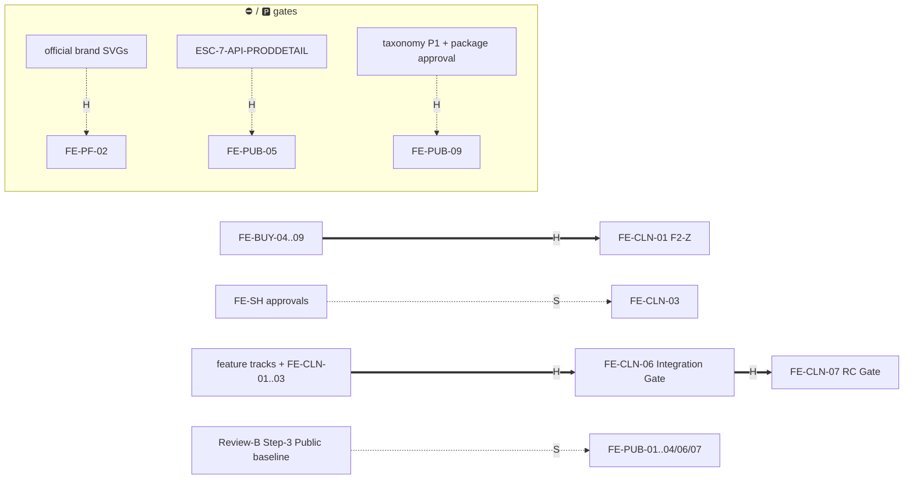

# FE Program WBS — Roadmap

**Frontend Program Management · v1.1 · Status: FROZEN at cutover (Board-ratified, plan v6,
2026-07-02).** Changes = additive amendment + version bump. Non-authoritative under the frozen
corpus (§7). **Owner (maintains): FE Program Manager** — status/derivation updates only; scope
changes and **new FE-* IDs are Board-only** (teams request, the Board mints).
**v1.1 (additive amendment, 2026-07-03):** Board-minted **FE-PUB-10 Canonical Vendor Subdomain**
(ADR-024 realization; owns no pages — coverage block untouched).
**v1.2 (additive amendment, 2026-07-03):** Owner Board-minted **Track 7 — FE-DOC Cross-workspace
Documents** (FE-DOC-00..04) + the **P-DOC page mint** (P-DOC-01..06; universe 144 → **150** — first
universe expansion since cutover; `page_inventory.md` §8A + coverage script UNIVERSE updated in the
same change). Additive composition only: existing document pages stay owned where they closed;
FE-DOC deep-links, never re-homes (FE-VEN-10/11/12 composition-not-fork precedent). Owner findings
adjudicated across 3 rounds at minting (WP cards carry the §13 Validate-Findings record).

**ROADMAP ONLY** — what · lifecycle owners · status · dependencies · gates. Queues and registers:
[`execution-board.md`](execution-board.md) · process: [`review-process.md`](review-process.md) ·
promotions: [`promotion-watchlist.md`](promotion-watchlist.md). `FE-*` IDs are program-management
handles, never corpus IDs; milestones **reference** frozen `P-*` pages
([`page_inventory.md`](../page_inventory.md)), never re-coin them.

**Wave-gate binding:** presentation-only parallel stream (owner-authorized, "parallelization, not
reorder") — never reorders or supersedes `generatedDocs/Build_Roadmap_v1.0.md`; wiring stays
wave-gated (§7).

## Derivation rule (binding)

Milestone status is **derived** from the owning team file's page rows (`team-1/2/3.md` = the
page-level source record) via the priority chain in `review-process.md` §9. **Owns vs touches:**
"owns" = coverage accounting (every P-* page exactly once program-wide); "touches" = may modify
without owning — only "owns" counts toward 150 (the frozen 144 + the additive P-DOC 6, v1.2).
**Page-gate carve-out:** an ESC-gated page inside
a milestone never blocks milestone close; it stays ⛔ tracked at page level and re-enters when its
handle resolves (the "cluster COMPLETE − P-ACC-12" convention). Statuses re-derived at cutover,
2026-07-02, post-RV-0100.

**Disambiguation:** shell *pages* (`P-SH-*`) are owned by milestone **FE-PF-06**; the **FE-SH-***
track is component *promotions* and owns no pages. `P-DOC-*` pages (cross-workspace, like `P-SH`)
are owned by **FE-DOC-01..03**; P-DOC-03..06 are one page ID with two route mounts (buyer + vendor).

## Row schema

`ID · Title · Value (immutable: Core Marketplace | Procurement Moat | Trust | Vendor Growth |
Buyer Productivity | Platform) · Builder/Maintainer · Priority (P0–P3, SC §8) · Size (S/M/L/XL) ·
Risk (Low/Med/High) · Depends-on (H: hard / S: soft — real dependencies only, never queue order) ·
Owns (P-*) · Status · Scope`. Business Value = program label grounded in CLAUDE.md §1, not a
corpus term; set at creation, Board-only changes.

---

## Track 0 — FE-PF Platform Foundation

**Baseline (historical record — closed, never reopens):**
FE-PF-01 Design Tokens ✅ (ongoing ownership → FE-DS) · FE-PF-03 Platform Shell ✅ **frozen**
(extend, never duplicate) · FE-PF-04 Responsive Framework ✅ · FE-PF-05 Navigation Framework ✅
(simple nav; mega menu = FE-PUB-09).

**Active:**

| ID · Title | Value | Bld/Mnt | Pri | Sz | Rk | Depends-on | Owns | Status · Scope |
|---|---|---|---|---|---|---|---|---|
| FE-PF-02 Brand System | Platform | Kit owner | P1 | S | Low | H: official SVGs (Board agenda #1) | — | 🟡 95% — runtime branding complete except official, unmodified SVGs under `public/brand/` (never regenerated) |
| FE-PF-06 Shell & System Pages | Platform | T1 | P1 | M | Med | — | P-SH-01..06 | ✅ Complete — 01/02/05/06 ✅ (RV ledger), 03/04 🟩 legacy. Shell-mount ratification (search/notifications) on Board agenda #8 |

## Track 1 — FE-PUB Public (Builder/Maintainer: Team-1)

| ID · Title | Value | Pri | Sz | Rk | Depends-on | Owns | Status · Scope |
|---|---|---|---|---|---|---|---|
| FE-PUB-01 Landing | Core Marketplace | P1 | M | Low | S: Step-3 baseline | P-PUB-01 | ✅ Complete (RV-0121, A:PASS B:PASS, Dev-team self-close 2026-07-03 @ `17f93a8`) — the "polish item" resolved to fixing the Command Center's popular-search terms, a concrete gap carried forward from FE-PUB-07's audit (RV-0119); 5 terms now genuinely match the seed; 2 OBS total, 0 B/M/M |
| FE-PUB-02 Discovery | Core Marketplace | P1 | L | Med | S: Step-3 baseline | P-PUB-07, P-PUB-09 | ✅ Complete (RV-0107, A:PASS B:PASS, Dev-team self-close 2026-07-02 @ `5d9d94a`) — Categories index (P-PUB-07): featured categories, capability cards, search entry-point polish, featured vendors/products over the 🟩 stock, 22 OBS total, 0 B/M/M/NIT. P-PUB-09 stays ⛔ `ESC-7-API-CATNAV` (page-gate carve-out, not built). Promotion candidate raised: `FeaturedCategoryGrid` extraction |
| FE-PUB-03 Vendor Profile | Vendor Growth | P1 | M | Med | S: Step-3 baseline | P-PUB-13..17 | ✅ Complete (RV-0111, A:PASS B:PASS, Dev-team self-close 2026-07-02 @ `1275f70`) — shared microsite-chrome delta: fixed stale pre-ADR-022 footer nav anchors → real routes; added spec-required sticky mobile enquire CTA. Favorite-vendor CTA + trust-ring cited out of scope (M4/Inv#6), not built |
| FE-PUB-04 Category Page | Core Marketplace | P1 | S | Low | S: Step-3 baseline | P-PUB-08 | ✅ Complete (RV-0116, A:PASS B:PASS, Dev-team self-close 2026-07-03 @ `4777e84`) — the WBS row said "🟩 partial, verify facets" but no implementation actually existed (`/marketplace` read zero query params); new drill-down route under `ESC-7-API-CATNAV`, 3 dead category links repointed; 4 OBS total, 0 B/M/M |
| FE-PUB-05 Product Detail | Core Marketplace | P1 | M | Med | ~~H: `ESC-7-API-PRODDETAIL`~~ **RESOLVED 2026-07-03 (owner Board, `R-ESC7-PRODDETAIL-FREEZE`)** | P-PUB-11 | ✅ Complete (RV-0132, A:PASS B:PASS, Dev-team self-close 2026-07-03 @ `50b3c0d`) — new standalone route realizing `marketplace.get_public_product_detail.v1` (Doc-4D v1.0.3/Doc-5D v1.0.1) + `ADR-025` canonical product URL law (`/marketplace/product/{name-slug}-{uuid}`, id-anchored, `permanentRedirect` on non-canonical/bare-id requests) + the Doc-5D breadcrumb deterministic pick rule against the real 794-node taxonomy tree; R9 non-disclosure via `notFound()`. **3-round fix-and-reverify**: round 1 caught a real MAJOR (retired interim's "More from {vendor}" section carried forward despite the folded contract's explicit related-items exclusion — removed, which also re-excluded the price it was smuggling back in); rounds 2–3 caught two stale governance comments the prior sweep missed. Interim `product-detail.tsx` retired, all call sites + `/search?product=` repointed. 2 non-gating OBS carried (case-sensitive UUID matching; plain-string UUID tiebreak compare). |
| FE-PUB-06 Vendor Directory | Vendor Growth | P1 | S | Low | S: Step-3 baseline | P-PUB-12 | ✅ Complete (RV-0118, A:PASS B:PASS, Dev-team self-close 2026-07-03 @ `4812157`) — spec's Toolbar delta named search as a gap the page never had; added the missing `SearchBar` entry point (existing kit component, no new primitive); 2 OBS total, 0 B/M/M |
| FE-PUB-07 Search Result | Core Marketplace | P1 | M | Low | S: Step-3 baseline | P-PUB-10, P-PUB-19, P-PUB-20 | ✅ Complete (RV-0119, A:PASS B:ISSUES-non-gating, Dev-team self-close 2026-07-03, audit-only zero code delta) — P-PUB-10/19/20 thoroughly audited, no genuine gap found; a real MAJOR finding [landing "Popular search" dead ends] correctly attributed to the separate, not-yet-started FE-PUB-01, carried forward not fixed here |
| FE-PUB-08 Content, Legal & Segments | Platform | P2 | — | Low | — | P-PUB-02..06, P-PUB-18, P-PUB-21..24 | ✅ Complete — all 10 ✅ (RV-0086..0100 era) |
| FE-PUB-09 Mega Menu & Taxonomy Nav | Core Marketplace | P2 | L | Med | ~~H: taxonomy P1 · H: MEGA_MENU package~~ **both CLEARED 2026-07-03 (owner Board)** · S: `ESC-7-API-CATNAV` (live data) stays open — build-time seed interim | — (touches nav + P-PUB-07/08/09 + P-PUB-08 landing enrich) | ✅ Complete (RV-0126, A:PASS B:PASS, Dev-team self-close 2026-07-03 @ `4d1aae8`) — phases 0–5 built, 3 rounds of owner findings adjudicated; then a **3-round fix-and-reverify cycle** (2 fix attempts self-verified with a flawed content fingerprint and didn't actually work, caught before shipping; real root cause = an always-eager SEO-nav component barrel-importing the whole heavy chunk, fixed round 3); empirically re-verified via independent isolated build + real interaction tracing. WP `governanceReviews/milestones/fe-pub-09-mega-menu/` |
| FE-PUB-10 Canonical Vendor Subdomain | Vendor Growth | P1 | M | Med | H: ADR-024 + Doc-7D §11 (ratified 2026-07-03 @ `c1187a8`; §11 corpus fold pending as a records action — build proceeds against the ratified section per its banner) | — (touches P-PUB-13..17 chrome + all vendor-link emitters) | ✅ Complete (RV-0128, A:PASS B:PASS, Dev-team self-close 2026-07-03 @ `cafefcb`) — presentation-mode-interim slice only: new `vendorHref(slug, subpage?)` central URL builder (ADR-024 Vendor URL Builder rule, SHALL), 16 call sites repointed off inline `/vendors/${slug}` concatenation, `alternates.canonical` + `openGraph.url` (absolute via `metadataBase`) added to all 7 microsite routes; byte-identical output verified (text/screenshot diff). One disputed MINOR (isolated-worktree prettier false positive) resolved via a zero-code-delta procedural re-review, full record RV-0128. **Real CHR resolution/middleware host-routing, path→canonical-host 301s, Host-Resolution-Matrix 404s, robots.txt/sitemap stubs, and dev `{slug}.localhost` verification are NOT built here** — they require a backend read (vendor subdomain binding, active-custom-domain status) this presentation-only codebase doesn't have; stay interim/open on `ESC-MKT-SUBDOMAIN-MIGRATE` (open) and `ESC-MKT-CANONICAL-URL` (resolved-with-interim) for a future wave. This builder is the single swap point that later wave needs. |

## Track 2 — FE-BUY Buyer (Builder/Maintainer: Team-2)

| ID · Title | Value | Pri | Sz | Rk | Depends-on | Owns | Status · Scope |
|---|---|---|---|---|---|---|---|
| FE-BUY-01 Dashboard | Buyer Productivity | — | — | — | — | P-BUY-01 | ✅ Complete (BX-01, RV-0070) — **BX-03 enhancement CLOSED** (RV-0133, `6316763`): WelcomeBand + KpiStatCard icon/tone + topbar search shortcut, owner-direct edit + Team-2 verification pass. **BX-04 enhancement CLOSED** (RV-0134): canonical Buyer sidebar IA — touches the shared shell (`NavItem.children`, additive) not just P-BUY-01, see `team-2.md` BX-04 row |
| FE-BUY-02 RFQ Workspace | Procurement Moat | — | — | — | — | P-BUY-06/07/08, P-BUY-10..13 | ✅ Complete (BX-02, RV-0075; F1 freeze audit covers 🟩 stock) |
| FE-BUY-03 Quotations | Procurement Moat | — | — | — | — | P-BUY-09 | ✅ Complete |
| FE-BUY-04 Quotation Detail | Procurement Moat | P1 | M | Med | — | P-BUY-14, P-BUY-16 | ✅ Complete (RV-0102, board-approved 2026-07-02 @ `5a4550c`) — **the awaited BX-03**: quotation presentation + clarification thread |
| FE-BUY-05 Supplier Comparison | Procurement Moat | P1 | M | High | — | P-BUY-15 | ✅ Complete (RV-0108, A:PASS B:PASS, Dev-team self-close 2026-07-02 @ `79b738a`) — R6: read-only, System-generated, **never recommends**; 6 OBS total, 0 B/M/M |
| FE-BUY-06 Award | Procurement Moat | P1 | S | High | — | P-BUY-17, P-BUY-18 | ✅ Complete (RV-0109, A:PASS B:PASS, Dev-team self-close 2026-07-02 @ `5654956`) — R6: no default winner, unranked; 10 OBS total, 0 B/M/M |
| FE-BUY-07 Engagement | Buyer Productivity | P1 | L | Med | — | P-BUY-19..25 | ✅ Complete (RV-0112, A:PASS B:PASS after 1 fix-and-reverify cycle, Dev-team self-close 2026-07-02 @ `2d1b23e`) — Documents card dead-end fixed with static nav to PO/Payments/Trade-invoice/Challan/WCC; money boundary DF-6 |
| FE-BUY-08 Dashboard Widgets | Buyer Productivity | P2 | S | Low | — | — (touches P-BUY-01) | ✅ Complete (RV-0113, A:PASS B:PASS, Dev-team self-close 2026-07-02 @ `d501345`) — Engagement pipeline widget added alongside BX-01's Sourcing pipeline, counts server-provided, never client-computed (R7, RV-0070 pattern); 12 OBS total, 0 B/M/M; promotion candidate registered |
| FE-BUY-09 CRM | Buyer Productivity | P2 | M | High | — | P-BUY-26, P-BUY-27 | ✅ Complete (RV-0114, A:PASS B:PASS, Dev-team self-close 2026-07-02 @ `adc84fa`, **audit-only — zero code delta**) — thoroughly re-audited, Inv#11 blacklist-undetectability independently re-verified live (`pv_04` list-row byte-identical to non-blacklisted rows), no safe enhancement found; forward-looking CRM↔Engagement cross-link candidate recorded for a future milestone |
| FE-BUY-10 Discovery & Favorites | Buyer Productivity | P2 | M | Med | — (owner decisions resolved 2026-07-03) | P-BUY-02..05 | ✅ Complete (RV-0117, A:PASS B:PASS, 0 BLOCKER/MAJOR/MINOR both lanes, `6306de4`) — P-BUY-02 ✅ (unchanged); P-BUY-03 ♻ superseded (reuse, no build); P-BUY-04 ✅ complete as a link-out to the public microsite (no in-app route); P-BUY-05 🅿 held (scope confirmed product/category, projection gap unresolved, out of this milestone) |

## Track 3 — FE-VEN Vendor (Builder/Maintainer: Team-3)

| ID · Title | Value | Pri | Sz | Rk | Depends-on | Owns | Status · Scope |
|---|---|---|---|---|---|---|---|
| FE-VEN-01 Dashboard | Vendor Growth | — | — | — | — | P-VND-01 | ✅ Complete (legacy; QCT Step-2 rollup) |
| FE-VEN-02 Company | Vendor Growth | — | — | — | — | P-VND-02..04 | ✅ Complete (legacy) |
| FE-VEN-03 Microsite | Vendor Growth | — | — | — | — | P-VND-05, P-VND-06 | ✅ Complete (legacy). M2.5 public-microsite continuation stays owner-gated (Board agenda #5) |
| FE-VEN-04 Catalog | Vendor Growth | P1 | M | Med | — | P-VND-07..11 | ✅ Complete (RV-0110, A:PASS B:PASS after 1 fix-and-reverify cycle, Dev-team self-close 2026-07-02 @ `4b4dc5c`) — 07/08/11 ✅(legacy) · P-VND-09 Spec library BUILT+CLOSED · P-VND-10 stays ⛔ `ESC-7-API/upload` (carve-out, does not block close) |
| FE-VEN-05 RFQ Workspace | Procurement Moat | P1 | M | Med | — | P-VND-15, P-VND-16 | ✅ Complete (RV-0101, A:PASS B:PASS, board-approved 2026-07-02 @ `e2f8642`) — received-only inbox needs-response-first ordering; decline = no penalty, clearer affordance |
| FE-VEN-06 Quotation Builder | Procurement Moat | P1 | L | Med | — | P-VND-17..20 | ✅ Complete (RV-0103, A:PASS B:PASS, board-approved 2026-07-02 @ `4ae0ec1`) — quotation-state visibility on the inbox, supersedes_version_no disclosure, withdraw = zero penalty; P-VND-18 wizard reviewed/untouched, S7 late-extension recorded as unbuilt gap |
| FE-VEN-07 Leads | Vendor Growth | P1 | M | Med | — | P-VND-21, P-VND-22 | ✅ Complete (RV-0104, A:PASS B:PASS, board-approved 2026-07-02 @ `b1810fe`) — next-action pill on Board cards, lead created_at provenance; client-side "due first" reorder explicitly declined (existing disabled sort control owns it) |
| FE-VEN-08 Engagements | Vendor Growth | P1 | L | Med | — | P-VND-23..27 | ✅ Complete (RV-0105, A:PASS B:PASS, board-approved 2026-07-02 @ `ec8306b`) — P-VND-24 frozen-conformant lifecycle single-next-legal-edge fix; P-VND-23 reviewed/conformant untouched; P-VND-25/26 correctly `ESC-7G-ENG-03`-gated untouched; P-VND-25 upload path still notes `ESC-7-API/upload`. **`P-VND-27` Finance/payments (J-SUP-07, same journey as P-VND-25/26) reassigned into this range 2026-07-03** — discovered mis-owned by `FE-VEN-10` (a stale pre-reuse-strategy mapping); genuinely unbuilt, own future remainder (mirrors the FE-VEN-04-remainder pattern) |
| FE-VEN-09 Trust Center | Trust | P1 | M | High | — | P-VND-28 | ✅ Complete (RV-0120, A:PASS B:PASS, no fix-and-reverify cycle, Dev-team self-close 2026-07-03 @ `32fe6fb`) — Trust Score card (band+numeric ring, per the Board ruling), Performance card (band/`level` only — numeric never public, frozen contract restriction), Verified Tier card (reuses `TierChip`); 2 OBS total, 0 B/M/M |
| FE-VEN-10 Billing | Platform | P2 | S | Med | — | — (reuses P-ACC-16..20; owns no page — see FE-VEN-08 coverage note) | ✅ Complete (RV-0123, A:PASS B:PASS, Review Team 5-approved 2026-07-03 @ `4e57bfc`) — 5-tab `workspace/billing` composing `PlansCatalog`/`SubscriptionView`/`UsageDashboard`/`LeadCreditsView`/`PlatformInvoicesView` unmodified; composition-not-fork independently verified both lanes; disclosed hard-coded-link trade-off (Plans→Subscription, Invoices-list→detail) honest, not a defect |
| FE-VEN-11 Organization | Platform | P3 | S | Med | — | — (reuses P-ACC-04..11) | READY(build) — same ruling as FE-VEN-10 |
| FE-VEN-12 Settings | Platform | P3 | S | Med | — | — (reuses P-ACC-02/03/15; P-ACC-13 carried forward) | READY(build) — same ruling as FE-VEN-10; **P-ACC-13 Workflow Settings scoped OUT** (buyer-only RFQ-approval content, ruled 2026-07-03) — ships 3 of 4 target pages |
| FE-VEN-13 Ads | Vendor Growth | P2 | M | Low | — | P-VND-12..14 | ✅ Complete (RV-0106, A:PASS B:PASS-after-fix, board-approved 2026-07-02 @ `34395b2`) — fresh 3-page build; P-VND-13 create-only (no `update_advertisement` contract exists); admin reviews via P-ADM-10/11 (M8 owns the effect, R5) |
| FE-VEN-14 Vendor↔Account Composition | Platform | P2 | S | Low | — | — (documentation only, owns no page) | ✅ Complete (RV-0122, Lane-L PASS 0 findings, Dev-team self-close 2026-07-03 @ `71dce2f`) — reuse/composition report delivered, `governanceReviews/FE-VEN-14-VENDOR-ACCOUNT-COMPOSITION-REPORT_v1.0.md`; **report-deliverable close only** — does NOT itself unblock FE-VEN-10/11/12, which stay gated on the Board's ruling on the report's route-topology recommendation + 2 routed findings (P-ACC-13, P-ACC-19) |

## Track 4 — FE-SH Shared Components (owns 0 pages — Board-gated promotions)

FE-SH-01 Data Tables (`DataListTable`) · FE-SH-02 Workspace Tabs (`WorkspaceTabs`) · FE-SH-03
Description List (`DescriptionList`) · FE-SH-04 Form Notes (`PresentationFormNote`) · FE-SH-05
Status Components (`state-display`/`StatusChip`) · FE-SH-06 Timeline (`ActivityTimeline`).
All **Candidate** — criteria, lifecycle state machine, and row detail:
[`promotion-watchlist.md`](promotion-watchlist.md). Maintainer of extractions: kit owner.

## Track 5 — FE-DS Design System (Builder/Maintainer: kit owner — Board-gated; owns 0 pages)

Owns the **full design system**: tokens, color, spacing, typography, iconography, primitives.
FE-DS-01 Color ✅ · FE-DS-02 Typography ✅ · FE-DS-03 Icons ✅ · FE-DS-04 Empty States ⬜ ·
FE-DS-05 Skeletons ⬜ · **FE-DS-06 Forms ⬜** (homes FZ-09 kit `FormField role="alert"` + `RadioRow`
promotion + undefined tokens `--iv-reading-max`/`--iv-form-max`) · FE-DS-07 Tables ⬜.
The kit is the frozen foundation — every FE-DS change is Board-gated.

## Track 6 — FE-CLN Cleanup & Promotion (after feature tracks)

| ID · Title | Value | Bld | Pri | Sz | Rk | Depends-on | Status · Scope |
|---|---|---|---|---|---|---|---|
| FE-CLN-01 Buyer F2-Z freeze remediation | Buyer Productivity | T2 | P1 | M | Low | H: FE-BUY-04..09 | ✅ Complete (RV-0115, A:PASS B:PASS, 0 B/M/M both lanes, Dev-team self-close 2026-07-02 @ `636c192`) — FZ-02/03/04/05/06/08/10/11 all fixed (2 file-count corrections to the report itself, §13); **excludes FZ-01 (→FE-CLN-02) + FZ-09 (→FE-DS-06)**, both confirmed untouched; a pre-existing shell a11y bug found during this milestone's axe sweep escalated to `execution-board.md` agenda #11, not fixed here |
| FE-CLN-02 Shell container sweep | Platform | Board-assign | P2 | M | Med | H: Board lead assignment | ⬜ — FZ-01 cross-team (all four surfaces likely double-wrap) |
| FE-CLN-03 Dedupe & shared extraction | Platform | Board-assign | P2 | M | Med | S: FE-SH approvals | ⬜ — executes approved promotions |
| FE-CLN-04 Dead code & naming | Platform | Board-assign | P3 | S | Low | — | ⬜ |
| FE-CLN-05 Documentation | Platform | Board-assign | P3 | S | Low | — | ⬜ |
| FE-CLN-06 Full-tree Integration Gate | Platform | Review Team 5 | P1 | M | Med | H: feature tracks + FE-CLN-01..03 | ⬜ — QCT 5-step Step 4 |
| FE-CLN-07 Release Candidate Gate | Platform | Review Team 5 | P1 | M | Med | H: FE-CLN-06 | ⬜ — QCT 5-step Step 5 |

## Track 7 — FE-DOC Cross-workspace Documents (owner Board-minted 2026-07-03, WBS v1.2)

Cross-platform Document Management surface spanning the procurement lifecycle (RFQ → Quotation →
PO → Challan → Trade Invoice → Payment). **Additive composition only** (owner decision 1,
2026-07-03): mints NEW `P-DOC-*` pages — per-workspace Documents hubs + the previously-unbuilt M4
BC-OPS-4 surfaces (document templates, generated documents) — and deep-links the 16 already-closed
document detail pages (FE-BUY-02/04/05/07 · FE-VEN-06/08 · FE-ACC-02), never re-homing or
duplicating them. UI renders **frozen document kinds only** (owner decision 2): Mushok/VAT,
credit/debit notes, packing lists, sales orders, contracts, digital signatures, expiry reminders
have zero corpus anchor → `esc_registry.md` §Document Management +
`governanceReviews/BOARD-PACKET-DOCUMENT-MANAGEMENT_v1.0.md` (human Board). P-DOC-03..06 are
**one page ID, two mounts** (buyer `/documents/*` + vendor `/workspace/documents/*`, shared
components — the composition precedent applied to pages).

| ID · Title | Value | Bld/Mnt | Pri | Sz | Rk | Depends-on | Owns | Status · Scope |
|---|---|---|---|---|---|---|---|---|
| FE-DOC-00 Charter & Governance Package | Platform | T2 | P1 | S | Low | — | — (docs/PM only) | 🔵A Lane-L 2026-07-03 — **deliverable COMPLETE @ `296b2d0`** (mint mechanics WBS v1.2 + coverage script + `page_inventory.md` v0.4 §8A + trackers; coverage verified PASS 150/150; 3 ESC rows; Board packet [agenda #13]; FE-SH-01 promotion request; both WP cards). Closes on deliverable only (FE-VEN-14 precedent) — the excluded-kinds + promotion Board rulings stay open without blocking builds. WP `governanceReviews/milestones/fe-doc-00-governance-charter/` |
| FE-DOC-01 Buyer Documents Hub | Buyer Productivity | T2 | P1 | M | Med | H: FE-DOC-00 (delivered) | P-DOC-01 | ✅ Complete (RV-0129, A:PASS B:PASS, 0 BLOCKER/MAJOR/MINOR both lanes, `3293009`) — buyer hub at `/documents` + BUYER_NAV entry + shell `documents` icon key (disclosed touches); LifecycleStrip (six frozen stage names; **navigation, not state**), `?q=`/`?view=`/`?stage=` allowlisted (refine-over-loaded-rows, no server-search claim — P-BUY-19 ruling honored), collapsed FilterSidebar (frozen facets, NO Project facet), BC-OPS-4 generated listing (opaque counterparty refs, ASYNC-pending + sharing-revoked honesty), per-engagement doc-route clusters + expandable process timelines (restated seeded facts), DF-6 callout, R6 comparison caption, M7 invoices separated; shared documents home (12 files) created here (known 2nd consumers, M8-extraction rationale); FE-SH-01 fallback = buyer DataListTable + shared column-model spec (no new table). tsc/eslint/prettier green; walkthrough 7/7 filter states + 8/8 deep links 200. Owner findings R1–R3 adjudicated in WP card. 1 pre-existing shared-shell a11y OBS carried forward to shell owner (quick-create mobile `button-name`, Board agenda #11). WP `governanceReviews/milestones/fe-doc-01-buyer-documents-hub/` |
| FE-DOC-02 Vendor Documents Hub | Vendor Growth | T3 | P1 | M | Med | H: FE-DOC-00 · S: FE-DOC-01 (pattern) | P-DOC-02 | ⬜ Registered — vendor hub at `/workspace/documents` (A7-neutral) + vendor nav entry; reuses vendor `document-status-chip`/`MoneyBoundaryBanner` exports + the shared documents home |
| FE-DOC-03 Templates & Generated Documents | Platform | T3 | P1 | L | Med | H: FE-DOC-00 · S: FE-DOC-01/02 (nav homes) · S: FE-SH-01 ruling (list infra; kit-primitive-rows fallback documented) | P-DOC-03..06 | ⬜ Registered — BC-OPS-4 UI: templates list/detail (fixed-five format enum verbatim, **no PO template**; draft/active/archived; immutable versions) + generated documents list/detail (DOC-… refs, storage refs, grant/revoke disabled); both mounts byte-identical via the shared home + shared `seed.ts`; adds hub cross-link cards (disclosed touch of P-DOC-01/02) |
| FE-DOC-04 Cross-link Entry Points & Detail Enrichment | Platform | Board-assign | P2 | M | Med | S: FE-DOC-01..03 | — (touches P-BUY-01/20..25, P-VND-01/24..26) | ⬜ Registered — carries owner findings MINOR-03 (detail-side timeline)/MINOR-04 (RelatedDocumentsRail)/NIT-3 (detail print): disclosed touches of closed pages; dashboard document cards; no client-computed counts (R7) |

## Track 8 — FE-PLAT Platform Readiness (PROPOSED — owner/Board ID mint pending, 2026-07-03)

Cross-cutting engineering readiness raised in this session's CTO-level audit (frontend-only,
doable before backend wiring — Wave 4). **Not yet Board-minted** — IDs below are proposed, framed
the same way FE-DOC was proposed before its 2026-07-03 mint. None own a page (like FE-SH/FE-DS/
FE-CLN); ownership is cross-team/Board-assign except where a single workspace is the natural home.

| ID · Title (proposed) | Value | Bld/Mnt | Pri | Sz | Depends-on | Scope |
|---|---|---|---|---|---|---|
| FE-PLAT-01 SEO Completion | Platform | Team-1 | P2 | S | — | `app/sitemap.ts`, `app/robots.ts`, JSON-LD structured data for public + vendor microsite pages. Per-page metadata/OG already exists (FE-PUB-10); this finishes Doc-7D's "published+Public content only in sitemap/metadata" requirement, not a new one |
| FE-PLAT-02 Component Documentation (Storybook) | Platform | Team-1 (kit owner) | P3 | M | — | `.storybook/` setup + stories for the newly-promoted `ComparisonTable`/`RfqCard` + existing `VendorCard`/`ProductCard`. Deliberately separate from FE-SH-01/05/07/08 (owner MINOR-1 — keep promotion diffs focused) |
| FE-PLAT-03 Security Foundation | Platform | Board-assign | P1 | M | — | CSP + security headers (`next.config.ts`/`middleware.ts`), dependency scanning (`dependabot.yml`/`npm audit` gate), production security checklist doc |
| FE-PLAT-04 Deployment Readiness | Platform | Board-assign | P2 | S | — | Production `Dockerfile` (current `docker-compose.yml` is dev-only Postgres), `vercel.json`, environment strategy doc |
| FE-PLAT-05 Monitoring & Observability | Platform | Team-1 (SDK init) → all teams (capture calls) | P2 | M | — | Wire the already-declared, currently-empty "telemetry hook point — GI-12" comments in `app/(public)/error.tsx` + `app/(app)/workspace/error.tsx`; PostHog SDK init (env already declared) + a small event taxonomy |
| FE-PLAT-06 Operational Documentation | Platform | Board-assign | P3 | M | — | Release checklist, rollback procedure, backup strategy, incident-response runbook, logging strategy doc — none exist in `generatedDocs/` or repo root today |
| FE-PLAT-07 Test Coverage — Shared | Platform | Team-1 | P1 | M | — | Unit tests for `src/frontend/primitives`/`components` (currently 2 unit test files total, 0 component-level); E2E harness beyond the single smoke test |
| FE-PLAT-08 Test Coverage — Buyer | Buyer Productivity | Team-2 | P1 | M | — | Workflow tests for RFQ/quote/engagement flows (currently 4 buyer-profile integration tests only, 0 RFQ/quote/engagement coverage) |
| FE-PLAT-09 Test Coverage — Vendor/Admin | Vendor Growth | Team-3 | P1 | M | — | Workflow tests for vendor RFQ/quotation/leads/engagements + admin queues (currently 0 vendor/admin test coverage; admin `*-seed.ts` fixtures exist with no assertions) |

**Not proposing:** i18n/Bengali localization (frozen corpus already closed this — Doc-7A MINOR-2,
Doc-7B BR7: locale set is a product requirement, deliberately deferred, not a gap) · frontend
contract-stub typing (ad-hoc-by-design per `quotation-view-models.ts`; formalizing now would edge
into Doc-4A/API-Gov territory ahead of real backend wiring).

## Record tracks (completed — closed, never reopen; future work coins new IDs)

| ID · Title | Bld/Mnt | Owns | Status |
|---|---|---|---|
| FE-ACC-01 Auth cluster | T1 | P-AUTH-01..08 | ✅ Complete (P-AUTH-01 🟩 pre-loop; RV-0004..0021) |
| FE-ACC-02 Account & Identity cluster | T1 | P-ACC-01..22 | ✅ Complete — **P-ACC-12 ⛔** `ESC-IDN-DELEG-EXPIRY` (page-gate carve-out, Board agenda #4); P-ACC-14 🟩 pre-loop |
| FE-ADM-01 Admin Console | T3 | P-ADM-01..29 | ✅ Complete (RV-0003..0084, all committed) |

## Dependency graph (real dependencies only)

(solid `==H==>` hard · dashed `-.S.->` soft)

## Coverage ledger — standing invariant: 150 pages, each owned exactly once

Verified by `scripts/verify-fe-wbs-coverage.mjs` at every Phase-B-class change (enumerated per-ID
check, not just the sum). Machine-readable block (script input — keep syntax: `P-XXX-NN`,
comma lists, `..` ranges):

<!-- coverage:begin -->
| Milestone | Owns |
|---|---|
| FE-PF-06 | P-SH-01..06 |
| FE-PUB-01 | P-PUB-01 |
| FE-PUB-02 | P-PUB-07, P-PUB-09 |
| FE-PUB-03 | P-PUB-13..17 |
| FE-PUB-04 | P-PUB-08 |
| FE-PUB-05 | P-PUB-11 |
| FE-PUB-06 | P-PUB-12 |
| FE-PUB-07 | P-PUB-10, P-PUB-19, P-PUB-20 |
| FE-PUB-08 | P-PUB-02..06, P-PUB-18, P-PUB-21..24 |
| FE-ACC-01 | P-AUTH-01..08 |
| FE-ACC-02 | P-ACC-01..22 |
| FE-BUY-01 | P-BUY-01 |
| FE-BUY-02 | P-BUY-06..08, P-BUY-10..13 |
| FE-BUY-03 | P-BUY-09 |
| FE-BUY-04 | P-BUY-14, P-BUY-16 |
| FE-BUY-05 | P-BUY-15 |
| FE-BUY-06 | P-BUY-17, P-BUY-18 |
| FE-BUY-07 | P-BUY-19..25 |
| FE-BUY-09 | P-BUY-26, P-BUY-27 |
| FE-BUY-10 | P-BUY-02..05 |
| FE-VEN-01 | P-VND-01 |
| FE-VEN-02 | P-VND-02..04 |
| FE-VEN-03 | P-VND-05, P-VND-06 |
| FE-VEN-04 | P-VND-07..11 |
| FE-VEN-05 | P-VND-15, P-VND-16 |
| FE-VEN-06 | P-VND-17..20 |
| FE-VEN-07 | P-VND-21, P-VND-22 |
| FE-VEN-08 | P-VND-23..27 |
| FE-VEN-09 | P-VND-28 |
| FE-VEN-13 | P-VND-12..14 |
| FE-ADM-01 | P-ADM-01..29 |
| FE-DOC-01 | P-DOC-01 |
| FE-DOC-02 | P-DOC-02 |
| FE-DOC-03 | P-DOC-03..06 |
<!-- coverage:end -->

**Coverage correction (2026-07-03):** `P-VND-27` (Finance/payments, vendor) reassigned from
`FE-VEN-10` → `FE-VEN-08`. Discovered during `FE-VEN-10`'s close: the WBS had mapped `FE-VEN-10`
("Billing," reusing `P-ACC-16..21`) to own `P-VND-27` — a stale, pre-reuse-strategy artifact.
`P-VND-27` is journey `J-SUP-07`, the same journey as `FE-VEN-08`'s own `P-VND-25`/`P-VND-26`
(delivery/trade-invoice), and is genuinely unbuilt — not touched by `FE-VEN-10`'s actual delivery
(which is 100% `P-ACC-*` composition, owns no `P-VND-*` page). Reassigned to `FE-VEN-08`'s range as
a disclosed, tracked remainder (mirrors the `FE-VEN-04`-remainder pattern) rather than left silently
orphaned. Checksum unaffected (VND still totals 28; `FE-VEN-10` now correctly owns 0).

Checksum: SH 6 + PUB 24 + AUTH 8 + ACC 22 + BUY 27 + VND 28 + ADM 29 + DOC 6 = **150**
(the frozen 144 + the additive P-DOC mint, v1.2 — owner Board-minted 2026-07-03).
Own-nothing milestones (by design): FE-PF-01..05 · FE-PUB-09 · FE-PUB-10 · FE-BUY-08 ·
FE-VEN-10/11/12 (composition-only, own no page) · FE-VEN-14 (documentation only) · FE-DOC-00
(docs/PM only) · FE-DOC-04 (cross-link touches only) · FE-SH-* · FE-DS-* · FE-CLN-*.

## Change control

Milestone scope/status changes only at Board close (or Board decision); every transition is a
`changelog.md` append (`YYYY-MM-DD · FE-XXX-NN · <from> → <to> · Owner: …`). History lives in the
changelog + WP cards, never as WBS columns. This board is derived — on conflict, the chain in
`review-process.md` §9 rules.
